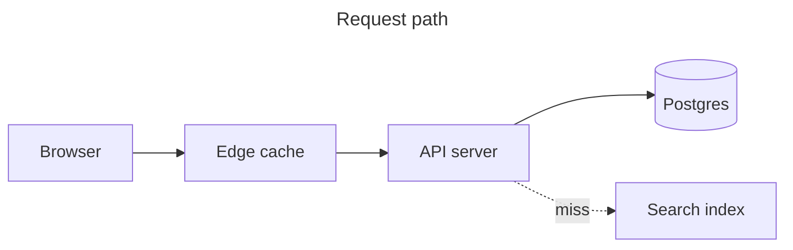
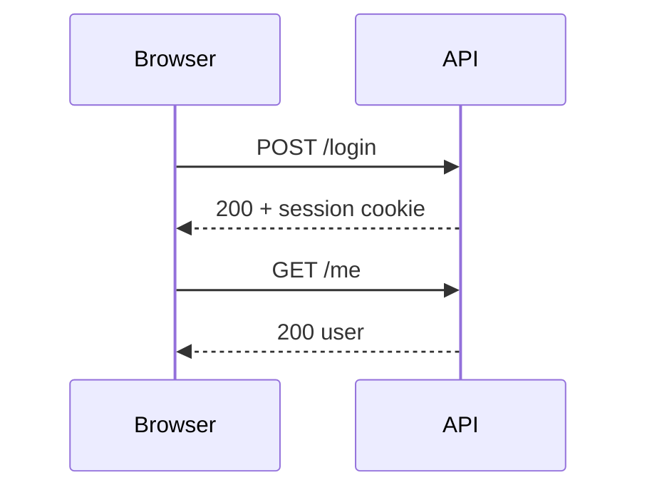
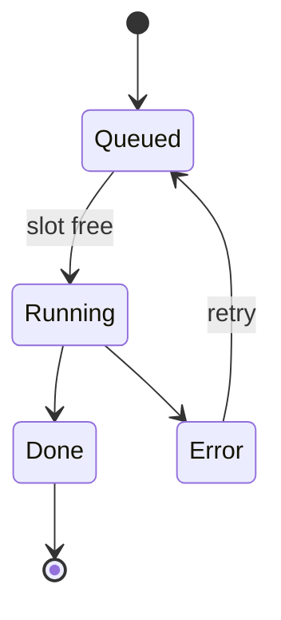
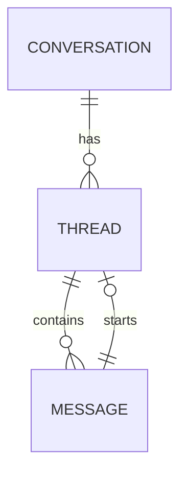

Diagrams for relationships the graph set cannot show.

```mermaid
---
title: Request path
---
flowchart LR
  client[Browser] --> edge[Edge cache]
  edge --> api[API server]
  api --> db[(Postgres)]
  api -. miss .-> search[Search index]
```

```mermaid
sequenceDiagram
  participant B as Browser
  participant A as API
  B->>A: POST /login
  A-->>B: 200 + session cookie
  B->>A: GET /me
  A-->>B: 200 user
```

```mermaid
stateDiagram-v2
  [*] --> Queued
  Queued --> Running: slot free
  Running --> Done
  Running --> Error
  Error --> Queued: retry
  Done --> [*]
```

```mermaid
erDiagram
  CONVERSATION ||--o{ THREAD : has
  THREAD ||--o{ MESSAGE : contains
  MESSAGE ||--o| THREAD : "starts"
```

```mermaid
flowchart TD
  A[Start --> B{{
```

Text after the broken diagram still renders.
