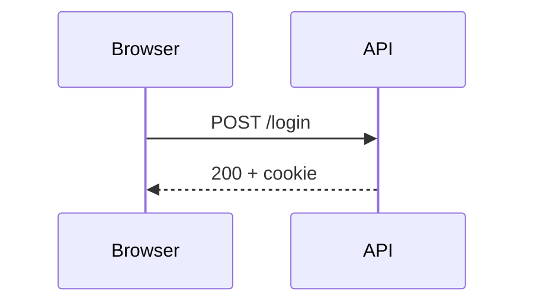

## Build health

The **nightly** build stayed green for 12 days; see [the dashboard](https://example.com/ci) and `ci.yml`.

- [x] Cache warmed
- [ ] Flaky test quarantined
  - nested item with *emphasis*

| Job | Time | Result |
| :-- | --: | :-: |
| lint | 1m 02s | ok |
| test | 7m 40s | ok |

```ts
export function retry<T>(fn: () => Promise<T>, times = 3): Promise<T> {
  return fn().catch((e) => (times > 0 ? retry(fn, times - 1) : Promise.reject(e)));
}
```

::graph-meter{title="Coverage" value=0.86 ticks=28}
::

::graph-table
---
title: Route bundles against budget
headers: [Route, First load, Budget]
align: [left, right, right]
rows:
  - ["/", "94 kB", "110 kB"]
  - ["/search", "204 kB", "180 kB"]
footer: [2 routes, "298 kB", "290 kB"]
---
::

::row{cols=2}
  ::graph-stat
  ---
  items:
    - { value: "99.98%", label: Availability }
    - { value: "128ms", label: p95 }
  ---
  ::

  ::graph-waffle{title="Rollout" value=0.72}
  ::
::



> Quote with a [link](https://example.com).

---

Done.
