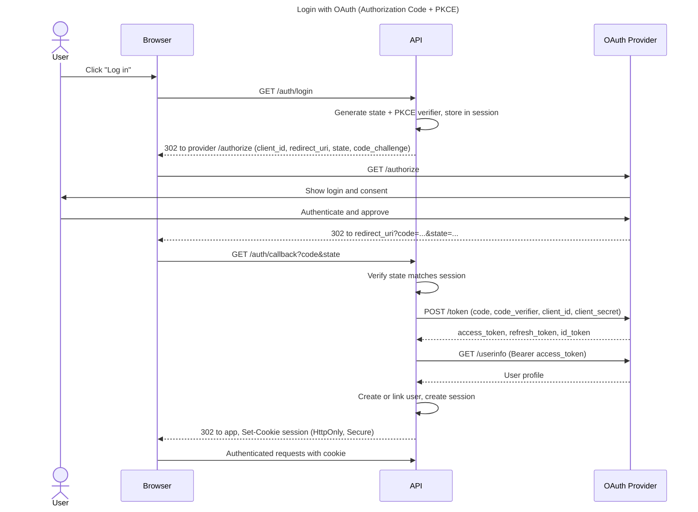

This assumes the standard OAuth 2.0 Authorization Code flow with PKCE. I haven't seen your codebase, so the endpoint names are generic.

- **Token exchange:** it is the `POST /token` step. It runs server to server, so the provider's tokens never reach the browser.
- **`state`:** the API checks it at the callback to prevent CSRF.
- **PKCE:** `code_verifier` ties the code to the session that started the flow. This protects against code interception.
- **Session cookie:** the browser only ever holds this cookie.

If you use a SPA that calls the provider directly, or return your own JWT instead of a cookie, tell me and I'll adjust the diagram.
